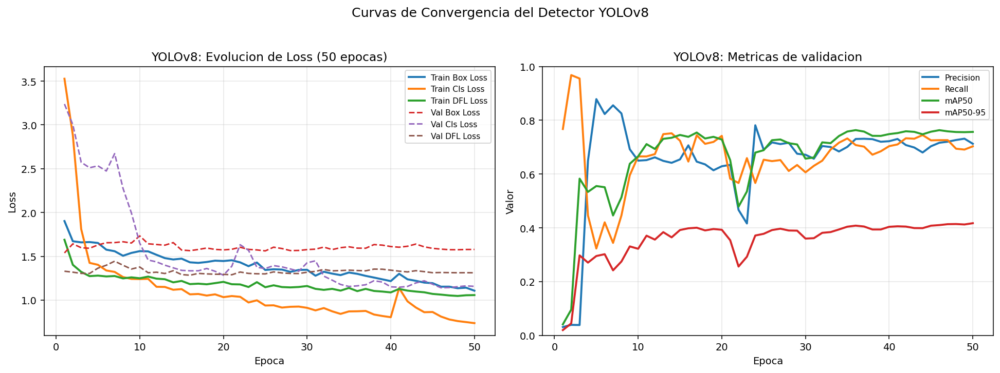
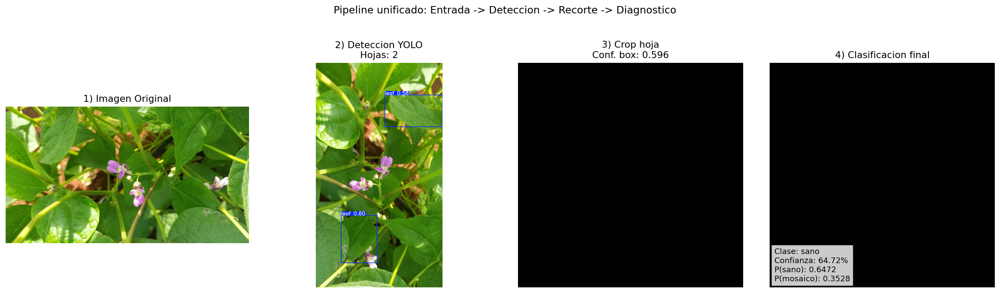
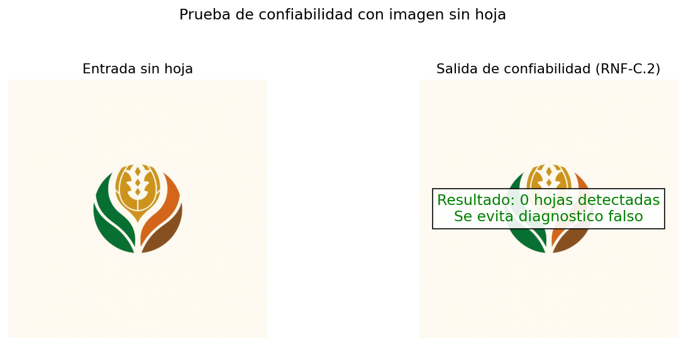

# Informe de Evidencia Visual - Capitulo 3 (Tesis Frijol)

## 1. Objetivo
Este informe consolida evidencia visual y cuantitativa para sustentar la validacion del sistema de IA en el Capitulo 3:
- Deteccion de hojas con YOLOv8.
- Clasificacion sanitaria con MobileNetV2 (TensorFlow y PyTorch).
- Integracion funcional del pipeline completo (entrada -> deteccion -> recorte -> diagnostico).

Los artefactos mostrados se tomaron de:
- `runs/detect/train/*`
- `models/classification/*`
- `reports/cap3_visual/*` (generado especificamente para este informe).

## 2. Graficas y Resultados Visuales para Cap. 3

### A. Validacion del Modelo de Deteccion (YOLOv8)

Metricas finales de deteccion (epoca 50, `runs/detect/train/results.csv`):
- Precision(B): **0.7127**
- Recall(B): **0.7031**
- mAP50(B): **0.7568**
- mAP50-95(B): **0.4172**

**A.1 Curvas de entrenamiento (convergencia)**


*Figura A1. Evolucion de losses y metricas de validacion en 50 epocas.*
Descripcion: esta figura resume el comportamiento global del entrenamiento YOLOv8. Se observa reduccion progresiva de las perdidas de entrenamiento y validacion, junto con estabilizacion de precision, recall y mAP hacia las ultimas epocas, lo cual indica convergencia del detector sin oscilaciones criticas.


*Figura A2. Curvas separadas para lectura mas clara de convergencia (loss, precision, recall y mAP).*
Descripcion: la separacion en dos paneles facilita la interpretacion. En el panel izquierdo, las curvas de `box_loss`, `cls_loss` y `dfl_loss` muestran tendencia descendente; en el derecho, precision/recall/mAP se mantienen en rangos estables al cierre (precision 0.7127, recall 0.7031, mAP50 0.7568), evidenciando aprendizaje efectivo.

**A.2 Matriz de confusion del detector**


*Figura A3. Matriz de confusion del detector en validacion.*
Descripcion: la matriz permite visualizar aciertos de deteccion de hojas frente a errores de asignacion. La mayor concentracion en la diagonal principal representa predicciones correctas; los valores fuera de la diagonal reflejan falsos positivos o falsos negativos en escenas complejas de campo.


*Figura A4. Matriz normalizada para observar proporcion de aciertos vs errores.*
Descripcion: al normalizar, cada celda se interpreta como proporcion relativa y no como conteo bruto, lo que facilita comparar desempeno entre clases y fondo. Esta vista es util para justificar que los errores no dominan el comportamiento general del detector.

**A.3 Ejemplos de inferencia visual (bounding boxes)**


*Figura A5. Ejemplo de inferencia del detector sobre imagenes de validacion con cajas delimitadoras.*
Descripcion: se observan cajas delimitadoras centradas en hojas de frijol con diferentes escalas y posiciones, validando la capacidad de localizacion espacial del modelo. La figura tambien evidencia que el detector prioriza regiones foliares por encima del fondo, paso clave para evitar recortes irrelevantes.

---

### B. Validacion del Modelo de Clasificacion (MobileNetV2)

Metricas actuales reportadas en `models/classification/compare_metrics.json`:

| Framework | Accuracy | Precision | Recall | F1 | AUC | ms/imagen |
|---|---:|---:|---:|---:|---:|---:|
| TensorFlow | 0.9877 | 0.9795 | 1.0000 | 0.9896 | 0.9999 | 36.78 |
| PyTorch | 0.9951 | 0.9917 | 1.0000 | 0.9958 | 0.9999 | 44.77 |

> Nota: si en tu redaccion final deseas mantener los valores historicos del manuscrito (p. ej. 1.0000 en TensorFlow), puedes incluirlos en la discusion metodologica como corrida previa y dejar esta tabla como corrida reproducida actual.

**B.1 Matrices de confusion comparativas**


*Figura B1. Matriz de confusion del clasificador TensorFlow.*
Descripcion: la diagonal principal concentra la gran mayoria de predicciones correctas. Los errores son minimos y se concentran en pocas muestras, lo que respalda un comportamiento consistente del clasificador en el conjunto de prueba.


*Figura B2. Matriz de confusion del clasificador PyTorch.*
Descripcion: la matriz presenta un patron similar al de TensorFlow, con diagonal dominante y muy baja tasa de confusion entre clases. En la corrida actual, PyTorch muestra menos errores absolutos (2 confusiones) y mantiene recall de 1.0.

**B.2 Curvas ROC**


*Figura B3. Curvas ROC comparadas; el AUC se mantiene practicamente en 1.0 en ambos frameworks.*
Descripcion: ambas curvas se ubican proximas al vertice superior izquierdo, indicando alta sensibilidad y baja tasa de falsos positivos para distintos umbrales. El AUC cercano a 1 confirma excelente capacidad de discriminacion entre `sano` y `mosaico_dorado`.

**B.3 Grafica de latencia**


*Figura B4. Latencia de inferencia promedio por imagen; TensorFlow presenta menor tiempo.*
Descripcion: la comparacion temporal evidencia ventaja operativa de TensorFlow en despliegue (36.78 ms/imagen frente a 44.77 ms/imagen en PyTorch). Esta diferencia respalda la seleccion del framework con mejor compromiso entre rendimiento y tiempo de respuesta.

**B.4 Resumen visual adicional de metricas**


*Figura B5. Comparacion global de accuracy, precision, recall y F1.*
Descripcion: la figura integra las metricas clave para contraste rapido entre frameworks. Se observa desempeno alto en ambos casos, con recall maximo y variaciones pequenas en accuracy/F1, lo que confirma robustez general del clasificador.

---

### C. Validacion del Pipeline Unificado (Prueba de Integracion Visual)

Secuencia requerida: **Imagen original -> Deteccion -> Crop -> Resultado final**.


*Figura C1. Evidencia visual integrada del flujo completo del sistema.*
Descripcion: la secuencia muestra, en una sola vista, la transformacion completa de la informacion: entrada original, deteccion de hojas, recorte de region de interes y clasificacion final con probabilidad. Esta evidencia visual valida funcionalmente la integracion backend-modelos y el cumplimiento del flujo RF7/RF8.

La inferencia estructurada del mismo ejemplo se guarda en:
- `reports/cap3_visual/inferencia_ejemplo_hoja.json`

En ese caso de prueba:
- Imagen de entrada: `data/raw/detection/campo/20201030_110157.jpg`
- Hojas detectadas: **2**
- Diagnostico general: **sano**
- Confianza por hoja (ejemplos): **64.72%** y **99.69%** para clase sana.

## 3. Pruebas de Validacion del Modelo

### 3.1 Pruebas unitarias del modelo (salida y rangos)
Se genero una validacion automatizada con checks tipo assert sobre:
- Rango [0,1] de precision/recall/mAP.
- Deteccion positiva en imagen con hojas.
- Probabilidades de clasificacion en rango y suma ~= 1.
- Deteccion nula en imagen sin hoja.

Archivo de evidencia:
- `reports/cap3_visual/prueba_unitaria_modelos.txt`

Resultado global:
- **PASS**

### 3.2 Pruebas de aceptacion (funcionales)
Evidencia funcional reproducida en salida de inferencia:
- `reports/cap3_visual/inferencia_ejemplo_hoja.json`

Para tesis, se recomienda agregar 2 capturas directas de interfaz web:
1. Pantalla con imagen de hoja y cartel de diagnostico + porcentaje.
2. Pantalla con imagen no valida (sin hojas) y mensaje de bloqueo de diagnostico.

Estas dos capturas refuerzan RF7 y RF8 desde la perspectiva de usuario final.

### 3.3 Prueba de confiabilidad (RNF-C.2)
Evidencia visual creada para caso sin hojas:


*Figura R1. El sistema evita emitir diagnostico sanitario cuando no detecta hojas.*
Descripcion: se presenta un caso negativo controlado (imagen sin hoja) donde el detector retorna `0` objetos y el sistema bloquea el diagnostico fitosanitario. Esta respuesta reduce falsos diagnosticos sobre fondo, suelo o elementos no biologicos, respaldando RNF-C.2.

Evidencia JSON asociada:
- `reports/cap3_visual/inferencia_ejemplo_sin_hoja.json`
- Resultado: `detecciones = 0`, mensaje `No se detectaron hojas`.

## 4. Evidencias extras recomendadas para fortalecer el capitulo
Adicional a lo solicitado, conviene incluir:
1. Curva Precision-Recall del detector: `runs/detect/train/BoxPR_curve.png`
2. Curvas individuales de precision/recall/F1 del detector:
   - `runs/detect/train/BoxP_curve.png`
   - `runs/detect/train/BoxR_curve.png`
   - `runs/detect/train/BoxF1_curve.png`
3. Distribucion visual de etiquetas de entrenamiento:
   - `runs/detect/train/labels.jpg`

Estas figuras elevan la calidad de la defensa tecnica al mostrar no solo el resultado final, sino la estabilidad del entrenamiento y la calidad de los datos.

## 5. Discusion tecnica para tu redaccion
En la discusion del Capitulo 3, deja explicito que:
- El desempeno alto en clasificacion puede estar influido por homogeneidad del dataset actual.
- Para reducir riesgo de sobreajuste, se recomienda validar en un conjunto externo con mayor diversidad: iluminacion, angulos, calidad de camara y condiciones de campo reales.
- El detector YOLOv8 aporta una barrera de seguridad funcional (no diagnosticar fondo/suelo sin hoja), cumpliendo con confiabilidad operacional en el pipeline.

## 6. Reproducibilidad de esta evidencia
Para regenerar los artefactos creados en `reports/cap3_visual`:

```powershell
.\.venv\Scripts\python.exe scripts/generar_evidencia_visual_cap3.py
```
