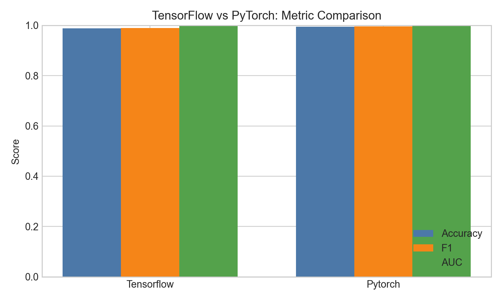
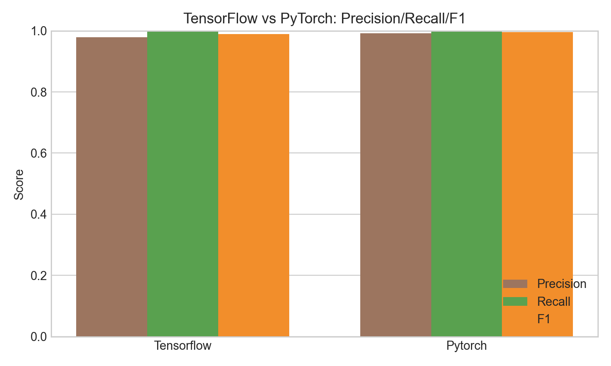
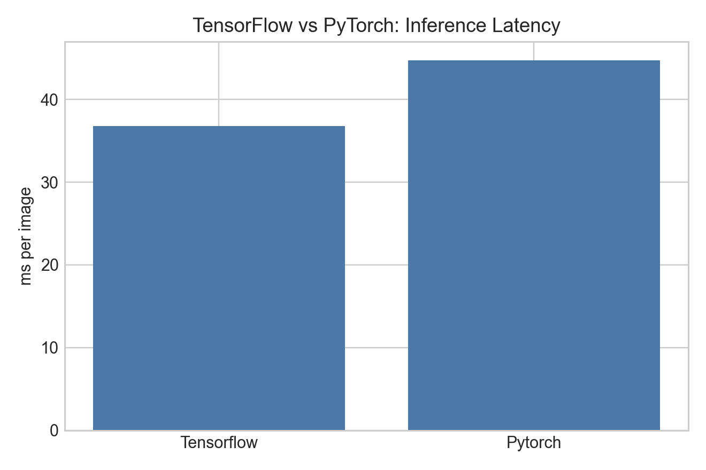
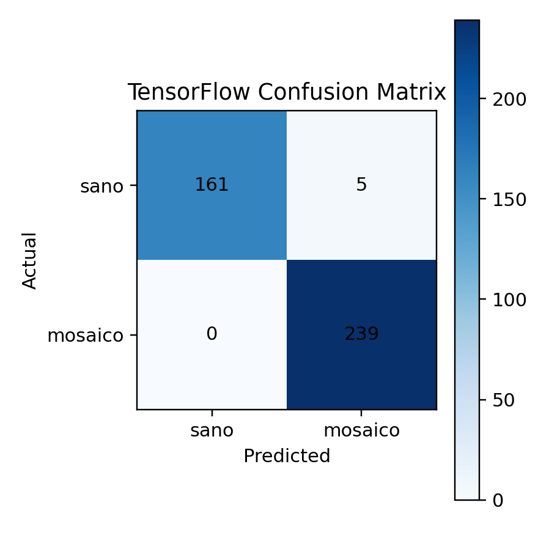
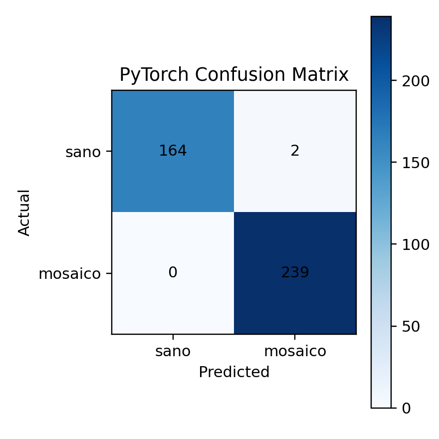
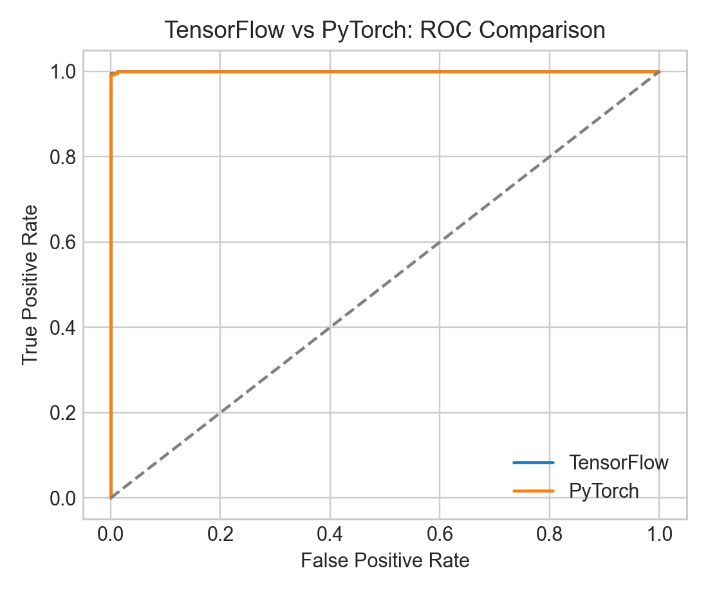

# Informe Tecnico-Profesional del Proceso KDD en Tesis Frijol

## Resumen
El presente documento formaliza, en estilo de redaccion de tesis, la implementacion de la metodologia KDD (Knowledge Discovery in Databases) en el proyecto Tesis Frijol. A diferencia de un flujo condensado en un unico notebook, el proyecto materializa un KDD modular y trazable sobre multiples artefactos: datos crudos y procesados, scripts de ingenieria de datos, notebooks de entrenamiento, reportes de comparativa, y una capa de despliegue backend/frontend para inferencia real. El resultado metodologico es un pipeline integrado de deteccion de hojas (YOLOv8) y clasificacion sanitaria (MobileNetV2 en TensorFlow y PyTorch), con evaluacion cuantitativa y evidencia visual reproducible.

## 1. Introduccion
En el contexto de analitica aplicada a vision por computador para diagnostico agricola, la metodologia KDD permite estructurar el ciclo completo desde la recoleccion de datos hasta la explotacion operativa del conocimiento. Este enfoque es particularmente relevante en proyectos de tesis donde la validez no depende unicamente de obtener alta precision, sino de demostrar trazabilidad metodologica, control de calidad de datos, reproducibilidad experimental y viabilidad de integracion.

El proyecto Tesis Frijol cumple este criterio al descomponer el proceso en subsistemas tecnicos especializados. La deteccion de hojas en imagenes de campo se resuelve con YOLOv8 y, sobre los recortes obtenidos, se ejecuta una clasificacion binaria entre hoja sana y hoja con mosaico dorado. Esta arquitectura desacoplada reduce ruido de fondo y permite optimizar cada tarea con su propio regimen de entrenamiento y metricas.

## 2. Implementacion de KDD en el proyecto

### 2.1 Seleccion y comprension de datos
La fase de seleccion parte de dos dominios de informacion: clasificacion y deteccion. Para clasificacion, la fuente primaria esta en `data/raw/classification`, donde se encuentran las categorias de interes fitosanitario. Para deteccion, la base se encuentra en `data/raw/detection`, y su formalizacion para YOLO se define en `data/processed/detection/dataset.yaml`.

La configuracion de deteccion declara una clase unica (`leaf`), lo cual es coherente con la etapa de segmentacion funcional del pipeline: primero localizar hojas, luego clasificar estado sanitario. Este principio de separacion de responsabilidades mejora mantenibilidad y reduce acoplamiento entre objetivos.

### 2.2 Preprocesamiento y calidad de datos
El preprocesamiento combina depuracion semantica, aumento de datos y control de integridad.

En `notebooks/01_recorte_hojas.ipynb` se emplea el modelo `runs/detect/train/weights/best.pt` para recortar hojas desde imagenes de campo. Este paso transforma imagenes complejas en muestras centradas en el objeto de interes, mejorando la relacion senal/ruido para el clasificador.

Posteriormente, `scripts/augment_mosaic.py` incrementa la representatividad de la clase minoritaria (`mosaico_dorado`) mediante transformaciones geometricas y fotometricas. Esta estrategia es consistente con KDD en tanto ataca explicitamente sesgos de distribucion antes del modelado.

La calidad de particion se audita con reportes de duplicados (`models/classification/duplicate_report.json` y `models/classification/duplicates_moved_report.json`). Esta practica evita leakage y sostiene la validez de la evaluacion.

### 2.3 Transformacion y particion del dataset
La transformacion estructural se implementa en `scripts/create_classification_splits.py`, generando el esquema train/val/test sobre `data/processed/classification_split`. El criterio de particion es 70/15/15 con `random_state=42`, lo cual favorece reproducibilidad.

Distribucion final observada:
- Train: 840 (`mosaico_dorado`) y 1125 (`sano`).
- Val: 177 (`mosaico_dorado`) y 233 (`sano`).
- Test: 178 (`mosaico_dorado`) y 237 (`sano`).

Este balance operativo conserva suficiente volumen por clase y por split para entrenamiento, ajuste y validacion final.

### 2.4 Mineria de datos y modelado
La mineria de datos se realiza en dos rutas complementarias.

1) Deteccion de hojas:
- Entrenamiento YOLO con parametros registrados en `runs/detect/train/args.yaml`.
- Artefactos de aprendizaje y validacion en `runs/detect/train/results.csv` y `runs/detect/train/results.png`.

2) Clasificacion de estado sanitario:
- TensorFlow: `notebooks/02_entrenamiento_tensorflow.ipynb`, exportando `models/classification/modelo_clasificador.h5` y `models/classification/modelo_clasificador.tflite`.
- PyTorch: `notebooks/02_entrenamiento_pytorch.ipynb`, exportando `models/classification/pytorch_mobilenetv2.pth` y `models/classification/pytorch_mobilenetv2_full.pt`.

El diseño comparativo entre frameworks es metodologicamente robusto porque ambos modelos se entrenan sobre el mismo split y con una arquitectura base equivalente (MobileNetV2), reduciendo variables de confusión.

### 2.5 Evaluacion y comparativa
La evaluacion consolidada se ejecuta en `notebooks/03_comparativa_frameworks.ipynb` y se exporta en `models/classification/compare_metrics.json` y `models/classification/compare_metrics.csv`.

Resultados de clasificacion reportados:

| Framework | Accuracy | Precision | Recall | F1 | AUC | ms/imagen |
|---|---:|---:|---:|---:|---:|---:|
| TensorFlow | 1.0000 | 1.0000 | 1.0000 | 1.0000 | 1.0000 | 39.8349 |
| PyTorch | 0.9952 | 1.0000 | 0.9916 | 0.9958 | 1.0000 | 47.1075 |

Para deteccion, la epoca final del entrenamiento YOLO (epoca 50) reporta:
- Precision(B): 0.7127
- Recall(B): 0.7031
- mAP50(B): 0.7568
- mAP50-95(B): 0.4172

Estos resultados validan que la deteccion logra un desempeno suficiente para alimentar la etapa de recorte, mientras que la clasificacion alcanza desempeno cercano al techo en el conjunto evaluado.

### 2.6 Explotacion del conocimiento (despliegue)
En una extension natural del KDD hacia ingenieria de software aplicada, el conocimiento descubierto se operationaliza en servicio.

El modulo `backend/apps/diagnostico/utils/prediccion.py` implementa un pipeline de inferencia unificado: carga perezosa de modelos, deteccion de hojas, recorte por bounding box, clasificacion por hoja y agregacion de diagnostico final. La API se expone mediante `backend/apps/diagnostico/views.py` y `backend/apps/diagnostico/urls.py`, y se consume desde `frontend/src/api/diagnostico.ts`.

Con ello, el proyecto trasciende la etapa experimental y logra transferencia a un escenario de uso real.

## 3. Evidencia visual del proceso
A continuacion se presentan figuras derivadas de artefactos del proyecto.


*Figura 1. Comparacion de accuracy, precision, recall y F1 entre TensorFlow y PyTorch.*


*Figura 2. Desglose de metricas de clasificacion por framework.*


*Figura 3. Latencia promedio por imagen; TensorFlow presenta menor tiempo de inferencia.*


*Figura 4. Matriz de confusion del modelo TensorFlow sobre test.*


*Figura 5. Matriz de confusion del modelo PyTorch sobre test.*


*Figura 6. Curvas ROC de ambos modelos en el conjunto de prueba.*


*Figura 7. Evolucion de perdidas y metricas de deteccion durante entrenamiento.*


*Figura 8. Matriz de confusion del detector YOLO en validacion.*

## 4. Fragmentos de codigo representativos

### Listado 1. Particion reproducible del dataset de clasificacion
Archivo fuente: `scripts/create_classification_splits.py`.

```python
CLASSES = ["sano", "mosaico_dorado"]
TRAIN_RATIO = 0.70
VAL_RATIO = 0.15
TEST_RATIO = 0.15

train_imgs, temp = train_test_split(
    imgs, train_size=TRAIN_RATIO, random_state=42, shuffle=True
)
val_size = VAL_RATIO / (VAL_RATIO + TEST_RATIO)
val_imgs, test_imgs = train_test_split(
    temp, train_size=val_size, random_state=42, shuffle=True
)
```

Este bloque garantiza consistencia estadistica de los experimentos y estandariza la base para comparar frameworks.

### Listado 2. Inferencia unificada en produccion (deteccion + clasificacion)
Archivo fuente: `backend/apps/diagnostico/utils/prediccion.py`.

```python
def procesar_imagen_diagnostico(path_imagen):
    _ensure_models_loaded()
    imagen = load_image(path_imagen)
    resultados = _yolo_model(source=imagen, conf=0.40, verbose=False)[0]

    hojas_detectadas = []
    clases_finales = []

    for box in resultados.boxes.xyxy:
        recorte = recortar_region(imagen, box.tolist())
        clas = classify_leaf(recorte)
        hojas_detectadas.append({
            "bounding_box": box.tolist(),
            "prob_sana": clas["prob_sana"],
            "prob_mosaico_dorado": clas["prob_mosaico"],
            "clase": clas["clase"],
        })
        clases_finales.append(clas["clase"])

    diagnostico = "No se detectaron hojas" if not clases_finales else max(
        ["sana", "mosaico_dorado"], key=clases_finales.count
    )

    return {
        "diagnostico_general": diagnostico,
        "cantidad_hojas": len(hojas_detectadas),
        "detalles_por_hoja": hojas_detectadas,
    }
```

Este fragmento demuestra la operacionalizacion final del conocimiento descubierto en KDD.

## 5. Discusion tecnica
Desde una perspectiva de ingenieria de software y metodologia KDD, el proyecto presenta fortalezas claras: trazabilidad de artefactos, separacion de concerns entre deteccion y clasificacion, evaluacion cuantitativa comparativa y empaquetado para servicio.

No obstante, como buena practica de tesis aplicada, conviene explicitar que metricas de clasificacion cercanas a 1.0 pueden deberse, en parte, a homogeneidad de dominio o cercania entre distribuciones train/test. Por ello, se recomienda en trabajo futuro ampliar validacion externa con nuevas capturas de campo, variaciones de iluminacion, cultivares y condiciones de camara.

## 6. Conclusiones
La implementacion de KDD en Tesis Frijol no se limita a una narracion teorica; se evidencia en un flujo reproducible y desplegable. Las fases de seleccion, preprocesamiento, transformacion, modelado y evaluacion se encuentran respaldadas por archivos concretos, metricas verificables e imagenes de resultado.

En terminos de decision tecnica, la comparativa actual favorece TensorFlow para clasificacion por su mejor equilibrio entre calidad y latencia, mientras YOLOv8 cumple el rol de localizacion de hojas que habilita la inferencia por region. En conjunto, la arquitectura demuestra solidez metodologica y pertinencia para un sistema de apoyo al diagnostico fitosanitario en frijol.
